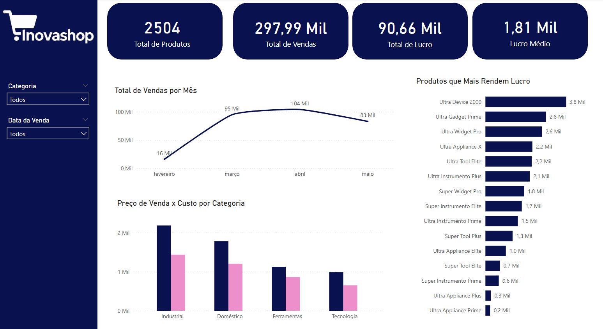

# 🛍️ Inovashop – Análise de Vendas com Python, Excel e Power BI

Este repositório contém um projeto de análise de vendas fictícias, criado com o objetivo de praticar a integração entre **Python**, **Excel** e **Power BI**.

---

## 🔧 Tecnologias Utilizadas

- **Python**: geração automatizada de planilha  
  - Bibliotecas: `random`, `datetime`, `openpyxl`
- **Excel**: estruturação e fórmulas automáticas
- **Power BI**: tratamento de dados e visualização interativa

---

## 📋 Etapas do Projeto

### 1. Geração de Dados com Python
Um script em Python foi utilizado para simular um estoque com:
- Produtos, categorias, quantidades
- Valor do fornecedor e margem de lucro
- Datas de venda geradas aleatoriamente
- Cálculo automático de preço de venda, lucro total e valor total

### 2. Planilha no Excel
A planilha foi salva automaticamente com as fórmulas aplicadas, pronta para ser importada no Power BI.

### 3. Dashboard no Power BI
No Power BI foram criadas colunas calculadas e medidas DAX para análise. O painel inclui:
- KPIs de vendas, lucro e produtos
- Evolução mensal de vendas
- Ranking de produtos mais lucrativos
- Comparativo entre preço de venda e custo

---

## 🎯 Objetivo do Projeto

Este projeto tem finalidade **educacional**, com foco em praticar:
- Automação de planilhas com Python
- Criação de dashboards com Power BI
- Análise de dados em cenários realistas
